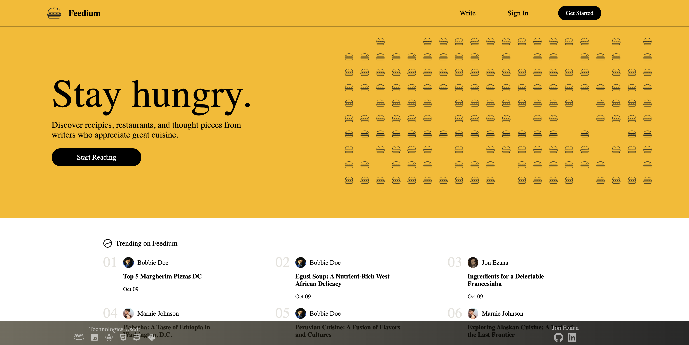
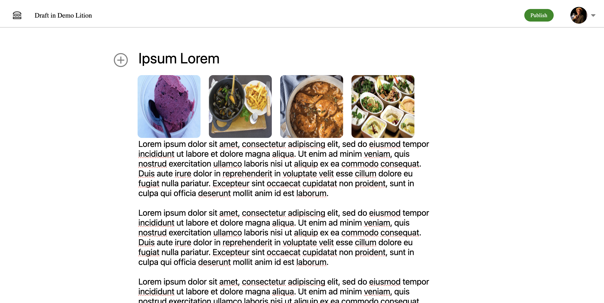
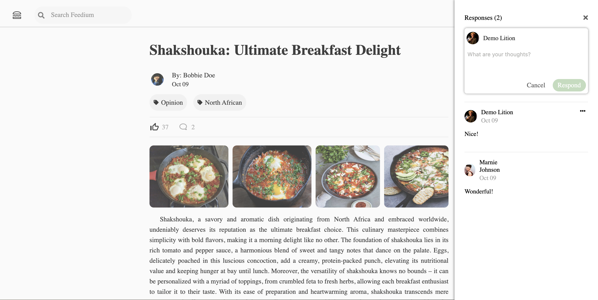
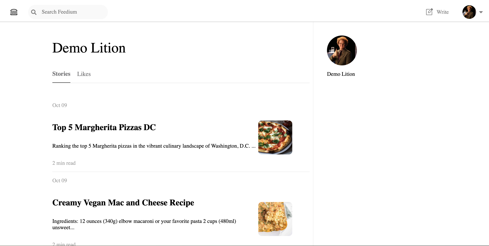

# Feedium

A clone of Medium made for food-lovers. Post recipies, dish ideas, or restaurant reviews and connect with foodies all over the world!

Checkout out [Feedium](https://feedium.onrender.com/) and find your inspiration.

## Index

[User Stories](https://github.com/JonEzana/feedium/wiki/User-Stories) |
[Database Schema](https://github.com/JonEzana/feedium/wiki/DB-Schema) |

## Technologies Used

## Landing Page

## Create Story Page

## Story Detail Page

## Profile Page

## Getting started
1. Clone this repository:
    * `https://github.com/JonEzana/Feedium.git`

2. Install dependencies into the Backend by running the following:
    * `pipenv install`

3. Install dependencies into the Frontend by cd into `react-app` and running the following:
    * `npm install`

4. Create a **.env** file using the **.envexample** provided

5. Set up your database with information from your .env and then run the following to create your database, migrate, and seed:
    * `pipenv run flask db migrate`
    * `pipenv run flask db upgrade`
    * `pipenv run flask seed all`

6. Start the app for backend using:
    * `pipenv run flask run`

7. Start the app for frontend by cd into `react-app` and running:
    * `npm start`

8. Now you can use the `Demo User` button to log in or Create an account

***

# Features

## Stories
Logged-in Users can
* post a story
* read/view other users' stories
* update their stories
* delete their stories

## Comments
Logged-in Users can
* post a comment for a photo under the photo detail page
* read/view other users' comments under a photo detail page
* delete a comment post by the logged-in user

## Likes
Logged-in Users can
* like/unlike a story by clicking the thumbs-up icon on the story detail page
* read/review other users' liked stories by checking the `Likes` tab on the user's profile page

# Connect
* Jon Ezana [GitHub](https://github.com/JonEzana) [LinkedIn](https://www.linkedin.com/in/jon-ezana-798a8419b/)
